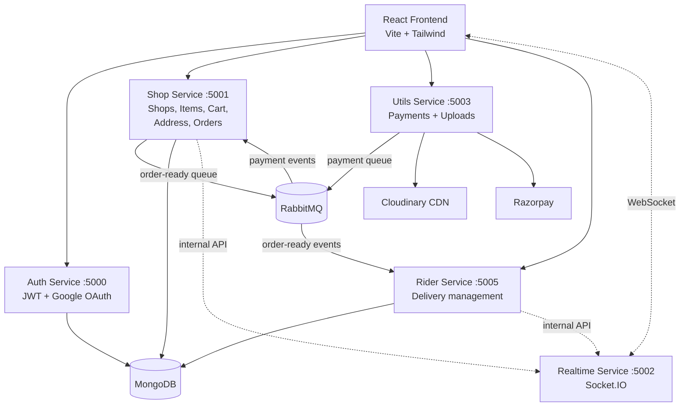
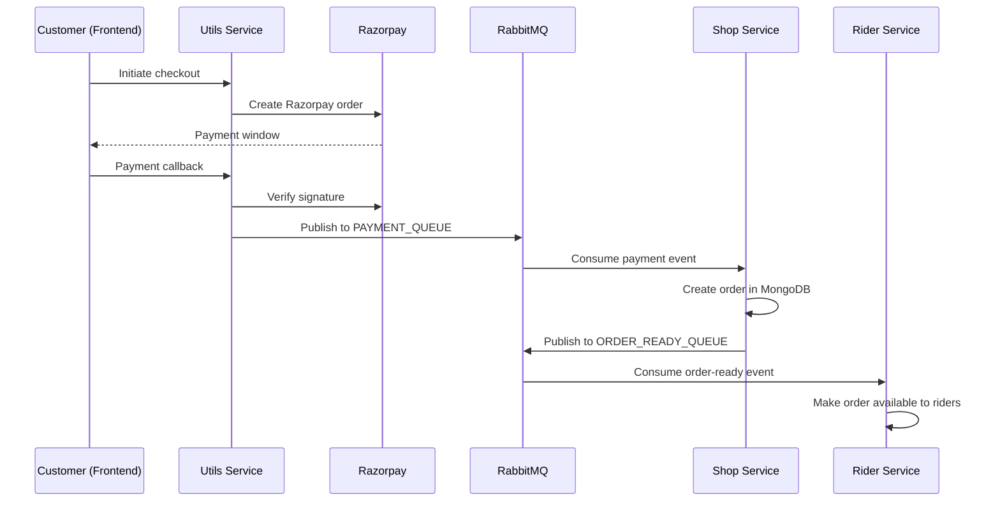

# Apni Dukan

A full-stack, microservices-based e-commerce platform connecting local shops, customers, and delivery riders — with real-time order tracking, live rider chat, and online payments.

## Live Demo

**🌐 [apni-dukan-dkpb.vercel.app](https://apni-dukan-dkpb.vercel.app)** — frontend on Vercel; backend services on Render free tier:

| Service | URL |
|---|---|
| Auth | [apni-dukan-auth-7tab.onrender.com](https://apni-dukan-auth-7tab.onrender.com) |
| Shop | [apni-dukan-shop-mbw2.onrender.com](https://apni-dukan-shop-mbw2.onrender.com) |
| Realtime | [apni-dukan-realtime-tun0.onrender.com](https://apni-dukan-realtime-tun0.onrender.com) |
| Utils (payments) | [apni-dukan-utils-uqg8.onrender.com](https://apni-dukan-utils-uqg8.onrender.com) |
| Rider | [apni-dukan-rider-gvmn.onrender.com](https://apni-dukan-rider-gvmn.onrender.com) |

> **Note:** free-tier services sleep after 15 minutes of inactivity — the first request may take up to a minute while they wake. Payments run in **Razorpay test mode** (test card `4111 1111 1111 1111`, any future expiry/CVV — no real charges).

## Tech Stack

**Frontend:** React 19, Vite, Tailwind CSS, Framer Motion, React Router, Leaflet (maps), Socket.IO client, Axios

**Backend:** Node.js, Express, MongoDB (Mongoose), RabbitMQ (amqplib), Socket.IO, JWT + Google OAuth, Razorpay (payments), Cloudinary (image storage), Multer

## Architecture

The backend is split into five independent services that communicate over REST for synchronous calls and RabbitMQ for asynchronous events:



| Service | Path | Default Port | Responsibility |
|---|---|---|---|
| Auth | `services/auth` | 5000 | Registration, login, Google OAuth, JWT issuance |
| Shop | `services/shop` | 5001 | Shops, inventory, cart, addresses, order lifecycle |
| Realtime | `services/realtime` | 5002 | Socket.IO server for live order updates and rider chat |
| Utils | `services/utils` | 5003 | Razorpay checkout/verification, Cloudinary image uploads |
| Rider | `services/rider` | 5005 | Rider onboarding, delivery assignment and status |

### Order & Payment Event Flow



Decoupling payment verification from order creation via RabbitMQ means a slow or restarting shop service never loses a paid order — the event waits in the queue.

### Image Upload Flow

1. Client uploads an image → the receiving service converts the buffer to a DataURI (Multer).
2. Utils service pushes it to **Cloudinary** and returns the secure URL.
3. Only the lightweight URL is stored in MongoDB; browsers load images straight from Cloudinary's CDN.

## Getting Started

### Prerequisites

- Node.js 18+
- MongoDB (local or Atlas)
- RabbitMQ (local or CloudAMQP)
- Cloudinary, Razorpay, and Google OAuth credentials

### 1. Install

```bash
# Frontend
cd frontend && npm install

# Each service
cd services/auth && npm install
cd ../shop && npm install
cd ../realtime && npm install
cd ../rider && npm install
cd ../utils && npm install
```

### 2. Configure environment

Create a `.env` file in each service directory:

<details>
<summary><code>services/auth/.env</code></summary>

```env
PORT=5000
MONGO_URL=mongodb://localhost:27017/apni-dukan
JWT_SEC=your-jwt-secret
GOOGLE_CLIENT_ID=...
GOOGLE_CLIENT_SECRET=...
```
</details>

<details>
<summary><code>services/shop/.env</code></summary>

```env
PORT=5001
MONGO_URL=mongodb://localhost:27017/apni-dukan
JWT_SEC=your-jwt-secret
RABBITMQ_URL=amqp://localhost
PAYMENT_QUEUE=payment_queue
ORDER_READY_QUEUE=order_ready_queue
RIDER_QUEUE=rider_queue
UTILS_SERVICE=http://localhost:5003
REALTIME_SERVICE=http://localhost:5002
INTERNAL_SERVICE_KEY=your-internal-key
```
</details>

<details>
<summary><code>services/realtime/.env</code></summary>

```env
PORT=5002
JWT_SEC=your-jwt-secret
INTERNAL_SERVICE_KEY=your-internal-key
```
</details>

<details>
<summary><code>services/utils/.env</code></summary>

```env
PORT=5003
RABBITMQ_URL=amqp://localhost
PAYMENT_QUEUE=payment_queue
CLOUD_NAME=...
CLOUD_API_KEY=...
CLOUD_SECRET_KEY=...
RAZORPAY_KEY_ID=...
RAZORPAY_KEY_SECRET=...
SHOP_SERVICE=http://localhost:5001
INTERNAL_SERVICE_KEY=your-internal-key
```
</details>

<details>
<summary><code>services/rider/.env</code></summary>

```env
PORT=5005
MONGO_URL=mongodb://localhost:27017/apni-dukan
JWT_SEC=your-jwt-secret
RABBITMQ_URL=amqp://localhost
ORDER_READY_QUEUE=order_ready_queue
RIDER_QUEUE=rider_queue
SHOP_SERVICE=http://localhost:5001
UTILS_SERVICE=http://localhost:5003
REALTIME_SERVICE=http://localhost:5002
INTERNAL_SERVICE_KEY=your-internal-key
```
</details>

<details>
<summary><code>frontend/.env</code></summary>

```env
VITE_AUTH_SERVICE=http://localhost:5000
VITE_SHOP_SERVICE=http://localhost:5001
VITE_REALTIME_SERVICE=http://localhost:5002
VITE_UTILS_SERVICE=http://localhost:5003
VITE_RIDER_SERVICE=http://localhost:5005
VITE_GOOGLE_CLIENT_ID=...apps.googleusercontent.com
```

`VITE_GOOGLE_CLIENT_ID` must be the same OAuth client as the auth service's `GOOGLE_CLIENT_ID` — the auth code is minted by the frontend's client and redeemed with the backend's, so a mismatch fails the token exchange.
</details>

### 3. Run

Start each service (in separate terminals), then the frontend:

```bash
cd services/<service-name> && npm run dev   # repeat for all five services
cd frontend && npm run dev                  # http://localhost:5173
```

## Features

- **Three roles** — customers browse and order, shop owners manage inventory and orders, riders deliver
- **Google OAuth + JWT** authentication with protected role-based routes
- **Event-driven order pipeline** — Razorpay payment verification triggers order creation and rider dispatch through RabbitMQ queues
- **Live order tracking & rider chat** over Socket.IO, with delivery location on Leaflet maps
- **CDN-backed images** via Cloudinary, keeping the database lean

## Deployment

The live demo runs entirely on free tiers:

- **Backend — Render Blueprint**: [`render.yaml`](render.yaml) defines all five services (Node runtime, `npm ci` + `npm start`, `rootDir` per service) plus a shared env group. Deploy via *New → Blueprint*; fill in the prompted secrets, then set `MONGO_URL` and `RABBITMQ_URL` on the env group in the dashboard (group-level `sync: false` values aren't prompted). Render injects `PORT` automatically. After the first deploy, align the inter-service URLs in `render.yaml` with the actual assigned domains.
- **Frontend — Vercel**: project root directory `frontend/` (Vite auto-detected). [`frontend/vercel.json`](frontend/vercel.json) rewrites all routes to `index.html` for React Router deep links. All five `VITE_*_SERVICE` env vars plus `VITE_GOOGLE_CLIENT_ID` must be set to the production values — they are baked in at build time, so changing one requires a redeploy.
- **MongoDB Atlas** (M0): network access must allow `0.0.0.0/0` — Render's free tier has no static egress IPs.
- **CloudAMQP** (Lemur): managed RabbitMQ; the `amqps://` URL goes into `RABBITMQ_URL`. Shop and rider auto-reconnect and re-register their consumers when idle connections are dropped.
- **Google OAuth**: the frontend uses popup (`postmessage`) mode, so only the Vercel domain needs to be in the OAuth client's *Authorized JavaScript origins* — no redirect URI.

### Free-tier limitations

- All five services sleep independently after 15 min idle; a cold full user journey may need several ~50s warmups. Each service exposes `GET /` as a health/warmup endpoint.
- Atlas M0 caps storage at 512 MB; CloudAMQP Lemur caps messages/connections.
- Known legacy quirk: `PaymentSuccess.jsx` references an unused `stripe-verify` route — actual payment verification happens in `Checkout.jsx` via `/api/payment/verify`.

## Project Structure

```
├── frontend/            # React SPA (customers, shop owners, riders)
├── services/
│   ├── auth/            # Authentication & user accounts
│   ├── shop/            # Core commerce: shops, items, cart, orders
│   ├── realtime/        # Socket.IO gateway
│   ├── rider/           # Delivery management
│   └── utils/           # Payments (Razorpay) & uploads (Cloudinary)
```
